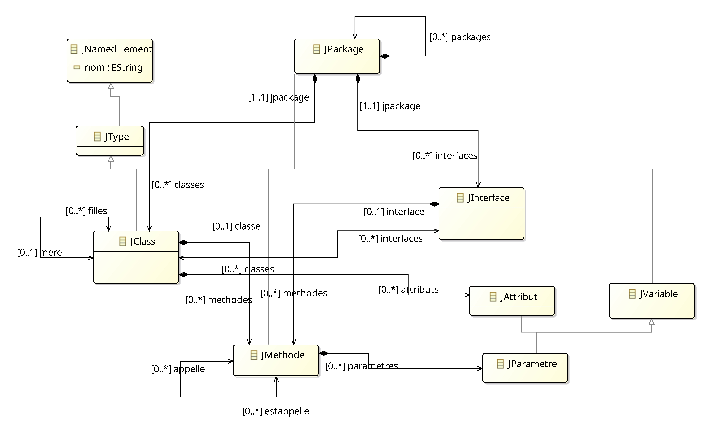
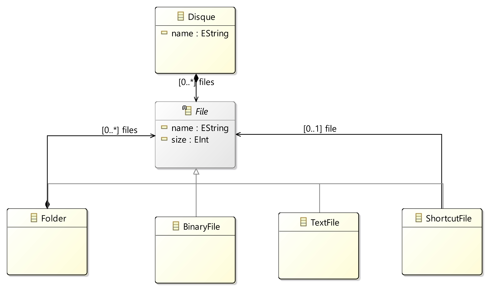
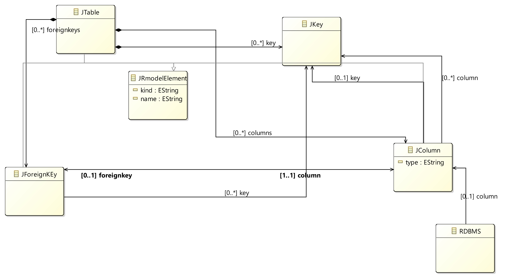

# Meta-modelisation

## TP1: Méta-modèles et outils de création

### 1- Modélisation du méta-modèle de Java simplifié

Pour cette partie du TP, on a créé le meta-model de Java simplifié suivant:

Les fichiers de tout ce qui a été fait sont dans le dossier [simplejava](./simplejava), ainsi que les model d'exemples.

### 2- Méta-modèle de FileSystem

On a créé le meta-model de FileSystem suivant:

### 3- Méta-modèle d'une base de données

Pour le meta-model de la base de données, on a utilisé le meta-model suivant:

## TP2 - Manipulation de modèles

### 1- Manipulation de simplejavaMM

Pour tester et manipuler les données de nos model, on a utilisé la class [JavaResourseSet.java](simplejava/src-gen/simplejavaresource/JavaResourceSet.java) qui permet de charger les model et de les manipuler. 

### 2- Manipulation de filesystemMM

On a utiliser le fichier [filesystem.ecore](metamodels/model/filesystem.ecore) pour creer le meta-model, en suite generer les classes java à l'aide du [filesystem.genmodel](metamodels/model/filesystem.genmodel).

On a utiliser le fichier [filesystem.xmi](metamodels/model/filesystem.xmi) pour creer un model d'exemple.

Et J'ai reponsu aux questions du TP dans le fichier java [FileSystemResourceSet.java](filesystem/src-../metamodels/src-gen/metamodels/filesystem/FileSystemResourceSet.java).

## TP3 - Metaprogrammation

Pour le TP noté, tous les fichiers sont dans le dossier [linter](./linter/).

## TP4 - Serialisation

Pour serialiser, j'ai utilisé Un nouveau package dans le dossier `simplejava`, [serialisation](./simplejava/src-gen/serialisation/) qui contient deux classes : 
    
- Launcher: qui recupere le JPackage de mon model XMI, et lance le `Serialiser`.
- Serialiser: contient les differentes methodes pour transformer les differentes classes de mon model à un json.

Le serialiser contient un attribut id qui permet de donner un id unique à chaque element et qui est incrémenté à chaque fois qu'on l'utilise. l'URI du model est aussi stocké dans le serialiser. et on plus on a une liste qui contient les json de tous les elements serialisé et un hashmap qui contient les elements de base (EObject) et l'Id.